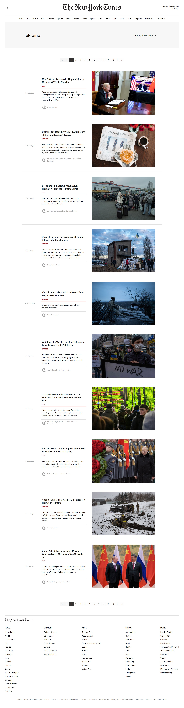

<p align="center">
  
  <h3 align="center">NyTimes Clone</h3>

  <p align="center">
    A partial clone of The New York Times website, built with React and New York Times API
  </p>

  <br>
  <br>

  <a href="https://github.com/Auro-93/nytimes-clone">
    
  </a>
</p>

<details open="open">
  <summary><h2 style="display: inline-block">Table of Contents</h2></summary>
  <ol>
    <li>
      <a href="#about-the-project">About The Project</a>
      <ul>
        <li><a href="#built-with">Built With</a></li>
      </ul>
    </li>
    <li>
      <a href="#getting-started">Getting Started</a>
      <ul>
        <li><a href="#prerequisites">Prerequisites</a></li>
        <li><a href="#installation">Installation</a></li>
      </ul>
    </li>
    <li><a href="#license">License</a></li>
    <li><a href="#links-contacts">Links & Contacts</a></li>
    <li><a href="#acknowledgements">Acknowledgements</a></li>
  </ol>
</details>

## About The Project

This is a React partial clone of the famous The New York Times website. Articles data are fetched from the [New York Times API](https://developer.nytimes.com/apis).
User can explore three main routes:

<ul>
<li>the <strong>home page</strong>, which contains most relevant articles currently on the first page; </li>

<li>specific <strong>sections</strong> like Politics, Health, Arts, which display most relevant articles of such categories; </li>

<li><strong>search section</strong>, which displays paginated articles based on the keyword typed by the user in the search-bar. Articles can be sorted by "relevance", "newest" and "oldest".</li>
</ul>

### Built With

- [React](https://it.reactjs.org/)
- [CSS modules](https://github.com/css-modules/css-modules)
- [Axios](https://github.com/axios/axios)
- [react-js-pagination](https://www.npmjs.com/package/react-js-pagination)
- [react-responsive](https://www.npmjs.com/package/react-responsive)
- [react-animation-on-scroll](https://www.npmjs.com/package/react-animation-on-scroll)
- [react-spring](https://react-spring.io/)

## Getting Started

### Prerequisites

Running the application requires [Node](https://nodejs.org/en/) to be installed on your operating system.

You can then install the latest version of npm from your terminal with the command:

```sh
npm install npm@latest -g
```

### Installation

1. Clone the repository locally with the git command:

   ```sh
   git clone https://github.com/Auro-93/nytimes-clone.git
   ```

2. Install NPM packages:

   ```sh
   npm install
   ```

3. Create an account on [New York Times API](https://developer.nytimes.com/get-started) website
   and follow the instructions to get your api-key

4. Create a .env file in the root folder with just one line:

   ```sh
   REACT_APP_NYTIMES_API_KEY = 'ENTER YOUR API KEY'
   ```

5. Run the app with command:

   ```sh
   npm start
   ```

## License

Distributed under the MIT License. See `LICENSE` for more information.

## Links & Contacts

[@Aurora Sirigu](https://www.linkedin.com/in/aurora-sirigu-a001301b4/) - 93a.sirigu at gmail dot com

Project Repository: [nytimes-clone](https://github.com/Auro-93/nytimes-clone)

Project Website: [NyTimes clone- Netlify](https://nytimes-clone.netlify.app/)

Portfolio: [aurodev-web-developer-portfolio](https://aurodev-web-developer-portfolio.netlify.app/)

## Acknowledgements

- [Best-README-Template](https://github.com/othneildrew/Best-README-Template)
- [Awesome README](https://github.com/matiassingers/awesome-readme)
- [New York Times API](https://developer.nytimes.com/)
- [CSS modules](https://github.com/css-modules/css-modules)
- [react-router-dom-v6](https://reactrouter.com/docs/en/v6/upgrading/v5)
- [react-js-pagination](https://www.npmjs.com/package/react-js-pagination)
